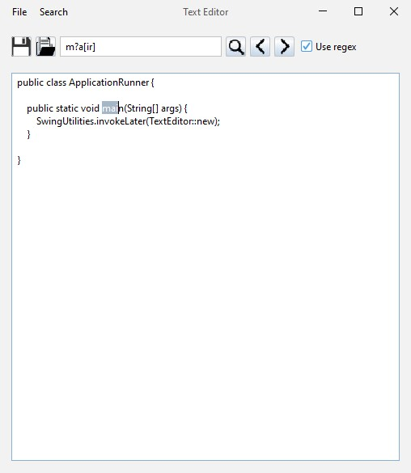

### Text Editor

This is a simple text editor written in Java using Swing. You can open, save, and edit text files. Also, there is a search feature with regex support.

### Contact ###
If you have any questions or suggestions, feel free to contact me on [LinkedIn](https://www.linkedin.com/in/douglasdotv) or by email (douglas16722@gmail.com).